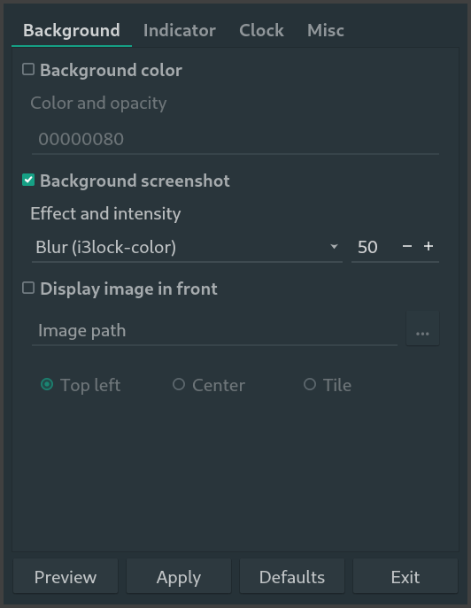

# i3lcc (i3lock-configuratorinator)
The mildly useful project nobody asked for! Configuration program for i3lock-color



To use, set './bin/i3lcc' as executable and run it.
This is in very early development, I highly recommend launching from a terminal so Python error messages can be read

### Dependencies:
```
pyqt5 python3 imagemagick i3lock-color libnotify-bin
```

## Short term goals:
  * Detect whether i3lock-color and imagemagick are on the system, display an error message if not found
  * Add more background screenshot filters using imagemagick (blur)
  * Find and squash bugs
  * Tweak and purdify code (especially getting rid of old, deprecated code)

## Mid term goals:
  * Create AUR and DEB packages (and maybe Flatpak? Fuck Snap.)
  * Add support for more image formats using imagemagick
